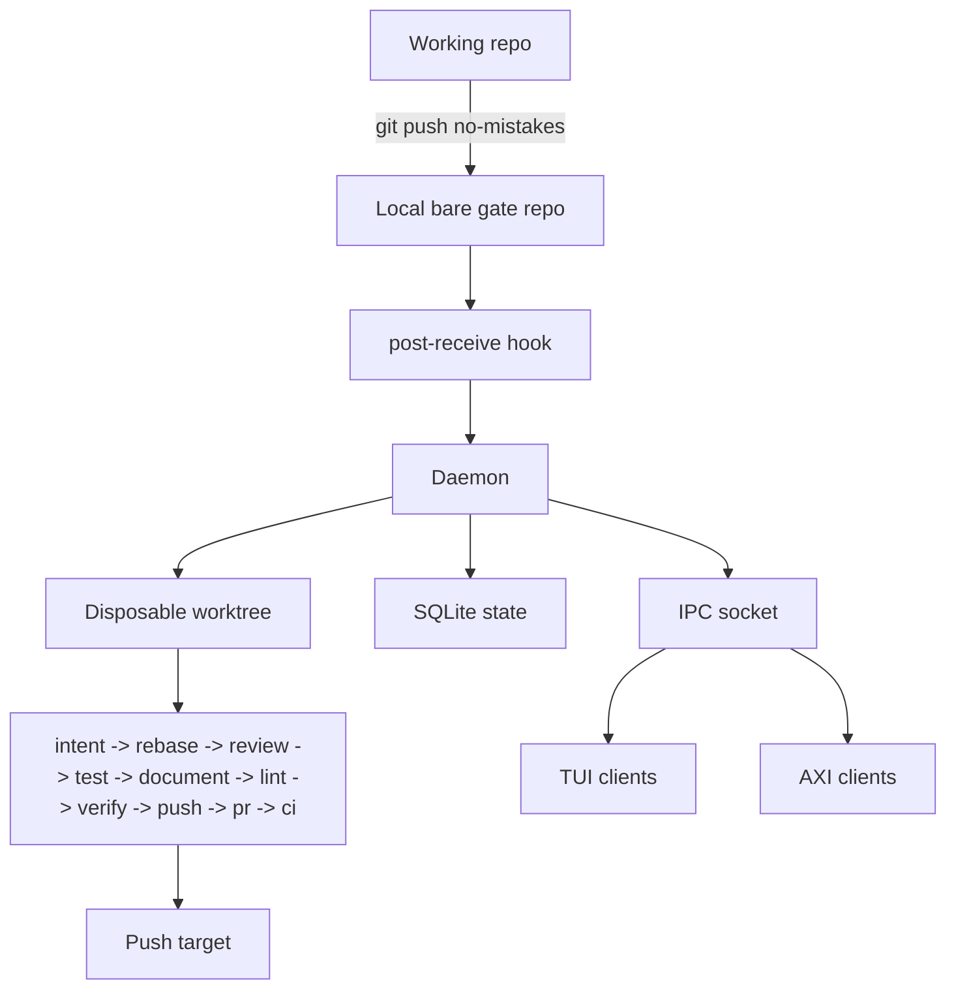

`no-mistakes` intercepts pushes by placing a local bare git repo between your working repo and the configured push target.
That bare repo is the gate.

The point is not to hide Git.
The point is to create one deliberate place where validation can happen before a branch is shared.

## Architecture overview

## What `no-mistakes init` does

When you run `no-mistakes init` in a repo:

1. It creates a local bare gate repo under `~/.no-mistakes/repos/<id>.git`.
2. It installs a `post-receive` hook in that gate repo.
3. It enables Git push options for the gate repo.
4. It best-effort isolates the gate repo's hooks path from shared local Git config writes when Git supports `config --worktree`.
5. It adds a `no-mistakes` remote to your working repo that points at the gate.
6. When `--fork-url` is supplied, it records that GitHub fork as the branch push target while keeping `origin` as the parent repository used for PR bases.
7. It installs or refreshes the `/no-mistakes` agent skill at user level, into `~/.claude/skills/no-mistakes/SKILL.md` and `~/.agents/skills/no-mistakes/SKILL.md`, on a best-effort basis, following existing symlinks between the home `.claude` and `.agents` skill directories.
   It writes no skill files into the repo; if the repo still carries a vendored copy from an older version, `init` prints a notice that the copy can be removed.
8. It makes sure the daemon is running so incoming pushes can start runs.

`init` is idempotent.
If the repo is already initialized, it refreshes the existing gate instead of failing: managed hook installation, push-option support, hook-path isolation, gate and working remotes, origin and default-branch metadata, and the `/no-mistakes` agent skill are repaired or updated where needed.
If the working repo was renamed or moved and the old path no longer exists, `init` reattaches the existing gate from the leftover `no-mistakes` remote, updates the stored working path, and preserves the repo ID plus run history.
If the working repo was copied and the original path still exists, `init` treats the copy as a new repo and repoints the copied `no-mistakes` remote to a fresh gate.
If daemon startup fails during a refresh, `init` reports the error but does not eject the pre-existing gate.

After init, your original `origin` still points at the real upstream remote.
With `--fork-url`, that `origin` should be the parent repository, and the fork URL is stored separately for branch pushes.
That is a core design choice, not an implementation detail.

## How a push flows

1. You run `git push no-mistakes <branch>`.
2. Git writes the push into the local bare gate repo, so the push itself stays fast.
3. The gate repo's `post-receive` hook notifies the daemon.
4. The daemon creates a detached worktree for this run.
5. The pipeline runs in order: `intent -> rebase -> review -> test -> document -> lint -> verify -> push -> pr -> ci`.
6. If a step pauses, you can attach with the TUI or use `no-mistakes axi respond` to approve, fix, or skip.
   Use `no-mistakes axi abort` only when you mean to cancel the whole run.
   AXI run objects show `awaiting_agent: parked <duration>` while a non-terminal run is parked at that gate, so a supervising agent can distinguish a waiting run from active work in one status read.
7. After Lint completes, the executor seals the publish candidate: the exact `HEAD` commit with a clean worktree.
   Verify then either skips an unchanged already-reviewed candidate or freshly verifies the whole candidate, and the push step transports that exact sealed commit only after verifying that the update will not discard unincorporated commits already on the target.
   For GitHub fork routing, the push target is the fork and the PR base repository is the parent from `origin`.
8. The CI step keeps watching the open PR until it is merged, closed, or its configured idle timeout elapses with no base-branch movement.
   A CI failure or merge conflict is repaired forward: the new patch passes local deterministic checks and a fresh strong verification, is sealed as a new candidate, and only that verified commit is republished.
   While it watches, the TUI and terminal title surface a `Checks passed` signal once checks are green and the PR is mergeable, and `no-mistakes axi` returns `outcome: checks-passed` with instructions to summarize the run and list any pipeline fixes, so agents stop and ask you to review and merge it.

Key design decisions:

- Named remote - `origin` is never hijacked.
  You push to `no-mistakes` on purpose, so regular `git push` still works normally.
- Disposable worktrees - each run happens in its own detached worktree under `~/.no-mistakes/worktrees/`.
  The daemon can safely modify files, run tests, and commit fixes without touching your working directory.
- Fixed pipeline - the step order is opinionated and not configurable: `intent → rebase → review → test → document → lint → verify → push → pr → ci`.
  What you can configure is the commands the test, lint, and format steps run, and whether transcript-based intent extraction is used when intent is not supplied directly.
  Model selection is the [routing contract](/no-mistakes/reference/routing/), and repair escalates through its cascade instead of counting attempts.
- Immutable seals - the publish candidate is recorded as an append-only seal after Lint, again after a clean strong review or verification, and again for every verified CI republication.
  Push refuses to publish anything except the exact latest sealed commit from a clean worktree.
- Remote data-loss guard - force-pushes are checked against the live push target and refused when they would discard commits the run did not incorporate.

## Why it is built this way

### Named remote

The remote is explicit because trust matters.
`no-mistakes` is an opt-in gate, not a trap door that silently rewires normal Git behavior.

### Bare gate repo

The local bare repo gives Git a normal place to receive pushes.
That keeps the push path simple and lets a standard `post-receive` hook hand work off to the daemon.

### Daemon

The daemon owns long-running work: creating worktrees, running the pipeline, streaming events, tracking state, and recovering from crashes.
Without it, the CLI would need to stay attached to every run.

### Disposable worktrees

The worktree is where `no-mistakes` can safely rebase, run commands, let models edit files, and commit fixes.
Your day-to-day working tree stays clean.

## Component overview

### Post-receive hook

When `git push no-mistakes <branch>` lands, the bare repo's `post-receive` hook fires.
It calls `no-mistakes daemon notify-push` with the gate path, ref name, old and new SHAs, and any Git push options such as `no-mistakes.skip=test,lint`.
The hook never blocks the push - Git ignores `post-receive` exit status, so pushes still succeed - but notification failures are surfaced to the pushing client on stderr and appended to `notify-push.log` in the bare repo for later inspection.

### Daemon

A long-running background process that manages pipeline runs.
It:

- listens on a Unix socket at `~/.no-mistakes/socket`
- writes its identity record to `~/.no-mistakes/daemon.pid`
- serializes concurrent pushes to the same branch (a new push cancels the in-progress run)
- creates and cleans up worktrees
- persists state to SQLite
- streams events to connected TUI clients via IPC

The installer prefers setting up the daemon as a managed background service, and `no-mistakes`, `init`, `attach`, `rerun`, and `update` make sure the daemon is running when needed.
Bare `no-mistakes` then attaches to the active run on the current branch when one exists, or routes to the setup wizard when it needs to create a new branch or run.
If managed service install or startup is unavailable or fails, startup falls back to a detached daemon process.
`update` resets the daemon after replacing the binary when the daemon is running or stale daemon artifacts exist.
If pending or running pipeline runs exist, `update` warns that restarting the daemon can cause those runs to fail and prompts before continuing.
If the daemon is already running from a different executable path, `update` prompts before replacing it.
The `-y` / `--yes` flag continues through update safety prompts while still printing warnings.
If the daemon executable path cannot be determined, `update` aborts before replacing anything.
You can also manage it explicitly with `no-mistakes daemon start|stop|restart|status`.

On startup, the daemon acquires its singleton lock before it changes run state or cleans worktrees.
It resumes only a running run that was durably parked at one fully reconstructable approval or fix-review gate.
Recovery verifies the run is the only active run for its repo and branch, the worktree still belongs to the gate at the recorded `HEAD`, the stored steps and latest round agree, and the recovered routing configuration is runnable.
When session reuse is active, every stored review-loop session must also name a provider still available in its recovered route.
The daemon returns a verified run to the same gate without rerunning completed steps, so you continue it with the normal `no-mistakes axi respond` command.
Every other stale pending or running run fails closed with `daemon crashed during execution`.
That failure also closes active step and round state, appends `interrupted` terminal facts to open routing attempts, retains any elapsed parked time, and makes the orphaned worktree eligible for cleanup.

### Pipeline executor

The executor runs each step sequentially and coordinates repair and approval.
It can end early after Rebase if the branch has no diff against the default branch, marking the remaining steps as skipped.

1. Execute the step.
2. Record a durable root lineage for every routed initial-review finding before anything can act on it.
3. Route blocking `auto-fix` findings through the [repair cascade](/no-mistakes/concepts/auto-fix/): a fresh fixer, the step's deterministic checks, then a separate fresh strong verifier, escalating `fix_fast → fix_balanced → authority_strong` and failing closed when the cascade is exhausted.
4. Pause for a decision when blocking findings remain unresolved, or when any finding has `action: ask-user` - no fixer touches an intent-sensitive finding before consent.
5. Refuse approval while any blocking finding lineage on the run remains unresolved; the user can fix selected findings, skip the step, or cancel the run instead.
6. After Lint, seal the publish candidate; after a Verify repair, seal the repaired candidate again.

While the executor is paused at an approval or fix-review gate, it persists a live run-level awaiting-agent timestamp that AXI renders as `awaiting_agent: parked <duration>`.
That timestamp is observability only and does not alter approval behavior.
When the wait ends, the executor clears the timestamp and adds the elapsed wall time to the run's durable parked total.
A safely recovered gate keeps the original timestamp, so the total includes the wait before the crash and the daemon downtime.
Recovery clears an unsafe run's timestamp only after adding that elapsed wait to its total.
`no-mistakes stats --run <id>` reports the accumulated parked total separately from step execution duration.

### IPC

Communication between the CLI and daemon uses JSON-RPC 2.0 over the Unix socket.
The `subscribe` method streams real-time events (step progress, log chunks, findings) to the TUI, while the `axi` commands use request and response IPC for non-interactive agent control.

### Database

SQLite at `~/.no-mistakes/state.sqlite` tracks repos, runs, step results, step rounds, and derived intent summaries.
Step rounds record each execution (`initial`, `auto_fix`, `repair_exhausted`) with its own findings and duration, plus selected finding IDs, whether the selection came from the user or automatic filtering, the merged finding payload actually sent to the fixer for that round, and the one-line fix summary for fix rounds.
That merged payload can include per-finding user notes and user-authored findings from the TUI or AXI interface.
Legacy `user_fix` rounds are still read as `auto-fix` for backward compatibility.

The routing cutover added append-only tables that make every model decision reconstructable:

- every candidate attempt gets an immutable, secret-free start fact (purpose, role, owner, profile, tier, candidate, runner, model, effort) and at most one terminal fact (outcome, failure domain, duration, token counts)
- finding lineages record the durable run-wide identity of every repairable finding, tied to the attempt that produced it
- finding repairs record each cascade round per lineage: tier, remaining budget, linked fixer and verifier attempts, deterministic check results, verdict, and status
- run seals record the immutable publish candidates: `pre_verify` after Lint, `reviewed` after a clean strong review or verification, and `ci_republish` for every verified CI republication
- utility scopes record standalone (non-pipeline) owners such as a Wizard session, so utility invocations never fabricate pipeline rows
- canary tables freeze the pre-routing baseline cohort and collect the first ten successful routed runs for the [canary report](/no-mistakes/reference/routing/#canary)

The routing attempt journal and local invocation performance records are separate contracts.
The append-only routing start and terminal facts are authoritative for candidate selection, escalation, provider failover, circuit skips, and reconnect projections.
The `agent_invocations` table is best-effort local performance evidence recorded after each concrete native invocation.
It stores the step, round, purpose, provider, reported model, session mode, fingerprinted session key, duration, bounded exit category, and token counts.
It never stores prompts, model output, diffs, credentials, raw errors, or raw session identities.
`no-mistakes stats --agents` and `no-mistakes stats --run <id>` read these local performance records, not the routing journal.

Intent stores the summary, source, session ID, and match score on each run when transcript matching is used, plus cached summaries for matching transcript sessions.
An agent-supplied AXI intent is stored directly on the run.
Raw transcript text is not stored in this database.
Prompts, model reasoning, credentials, and environment values are never stored.
Run records also store the nullable `awaiting_agent_since` timestamp used only to render the AXI parked signal while a gate is waiting for the driving agent.
Repo records store the parent `upstream_url` and an optional `fork_url`; branch pushes use `fork_url` when present, while PR and CI provider context stays anchored to the parent.

## Local state

Everything lives under `~/.no-mistakes/` by default.
Set `NM_HOME` to relocate it.

| Path | Contents |
|---|---|
| `state.sqlite` | SQLite database |
| `socket` | Unix domain socket for IPC |
| `daemon.pid` | Daemon identity record |
| `config.yaml` | Global configuration |
| `update-check.json` | Cached update check result |
| `telemetry-gate.json` | Local cross-process sampling state for high-frequency read-only command telemetry |
| `servers/` | PID-tracking records for managed agent servers |
| `repos/<id>.git` | Bare gate repos |
| `repos/<id>.git/notify-push.log` | Persistent hook notification failure log |
| `worktrees/<repoID>/<runID>/` | Disposable worktrees (cleaned up after each run) |
| `logs/<runID>/<step>.log` | Per-step log files |
| `logs/daemon.log` | Daemon log |
| `logs/wizard-agent.log` | Managed agent-server output captured during setup wizard runs |

New repo IDs are the first 6 bytes (12 hex chars) of `sha256(absolute_working_path)`.
When an initialized working repo is renamed or moved, `init` preserves the existing repo ID instead of deriving a new one from the new path.
