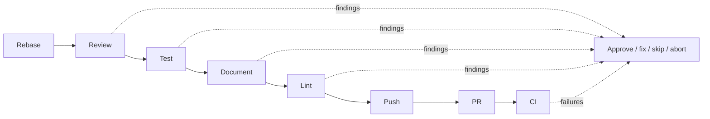

The pipeline runs a fixed, opinionated sequence of steps. Order is not configurable. What each step runs *is*.

```
rebase → review → test → document → lint → push → pr → ci
```



This page is the overview. For each step's exact behavior, defaults, skip rules, and fix-commit format, see [Pipeline Steps](/no-mistakes/reference/pipeline-steps/).

## What a passed gate means

The pipeline is opinionated so that "passed the gate" has a stable meaning:

- the branch was checked against fresh upstream first
- review, tests, docs, and lint happened before any upstream push
- the human stayed in control when a step needed judgment
- push, PR creation, and CI monitoring only happened after the local gate was satisfied

## The eight steps

| # | Step | What it does | Default auto-fix limit |
|---|---|---|---|
| 1 | **Rebase** | Fetch upstream, rebase your branch onto it | `3` |
| 2 | **Review** | AI code review of your diff | `0` (requires approval) |
| 3 | **Test** | Run your tests, or let the agent detect them | `3` |
| 4 | **Document** | Check for missing or stale doc updates | `3` |
| 5 | **Lint** | Run lint/static analysis | `3` |
| 6 | **Push** | Push the validated branch upstream | n/a |
| 7 | **PR** | Create or update the pull request | n/a |
| 8 | **CI** | Watch CI + mergeability, auto-fix failures | `3` |

## Why these steps, in this order

- **Rebase first** so everything else runs against the latest upstream. If there's no diff left after the rebase, the pipeline skips the rest.
- **Review before test** so the agent reads fresh code, not code it may have touched during fixes.
- **Document after test** so docs are checked against code that's known to work.
- **Lint last among local checks** so it doesn't churn over code that may still change.
- **Push → PR → CI** happens after all local checks pass. CI is the only step that talks to the outside world for validation.

## What each step can do

Every step can:

- **Complete** cleanly and advance the pipeline.
- **Return findings** with severity (`error`, `warning`, `info`) and an action (`auto-fix`, `ask-user`, `no-op`).
- **Trigger auto-fix** if the step's `auto_fix` limit is above 0 and any finding is `auto-fix`-eligible.
- **Pause for approval** if blocking findings remain after auto-fix, or if any finding is `ask-user`.
- **Skip** when there's nothing to do (e.g., no diff, unsupported host).
- **Fail** on fatal errors and stop the pipeline.

See [Auto-Fix Loop](/no-mistakes/concepts/auto-fix/) for how the fix cycle works, and [Using the TUI](/no-mistakes/guides/tui/) for what the approval UI looks like.

## What you can configure

You can't reorder steps. You *can*:

- Swap the agent (global or per-repo).
- Set explicit `commands.test`, `commands.lint`, `commands.format`.
- Control auto-fix limits per step.
- Ignore paths during review and documentation checks.

See [Configuration](/no-mistakes/guides/configuration/).

## What you can't configure

- The step order.
- Skipping specific steps permanently - you can skip them per-run from the TUI, but the pipeline itself always has all eight.
- Adding new steps.

This is intentional. The pipeline is opinionated so that "passed the gate" means the same thing across repos.
