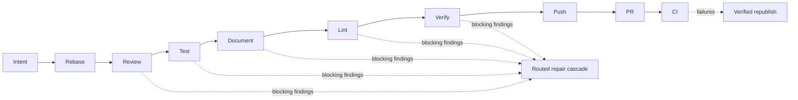

The pipeline runs a fixed sequence of ten steps.
The order is not configurable.
What each step runs is.

```
intent → rebase → review → test → document → lint → verify → push → pr → ci
```



This page is the overview.
For each step's exact behavior, skip rules, and fix-commit format, see the [pipeline steps reference](/no-mistakes/reference/pipeline-steps/).
For how findings are repaired, see [automatic repair](/no-mistakes/concepts/auto-fix/).
For how every model invocation is selected, see the [routing reference](/no-mistakes/reference/routing/).

## What a passed gate means

The pipeline is opinionated so that "passed the gate" has a stable meaning:

- the branch was checked against the freshly fetched remote upstream and the pushed-branch target first
- a fresh strong review, tests with user-facing evidence when available, independently verified documentation, and lint all happened before any branch push to the configured target
- every repair in a routed repair cascade was independently adjudicated by a separate fresh verifier before it counted as resolved; the agent-driven lint safe-fix path instead re-runs its own checks and reports anything unresolved as findings
- the publish candidate was sealed as one exact commit, verified, and pushed unchanged
- the human stayed in control: intent-sensitive findings waited for explicit consent
- the final branch update was guarded against discarding unincorporated commits already on the push target
- push, PR creation, and CI monitoring only happened after the local gate was satisfied

## The ten steps

| # | Step | What it does |
|---|---|---|
| 1 | Intent | Use supplied intent or infer it from recent local agent transcripts |
| 2 | Rebase | Fetch fresh remote state and rebase your branch onto it |
| 3 | Review | Fresh strong AI review of your diff, with routed repair of blocking findings |
| 4 | Test | Run baseline tests, gather evidence for the intent, and commit publishable test outputs |
| 5 | Document | Author documentation updates, then verify them with a separate fresh model |
| 6 | Lint | Run the formatter and linters, commit the results, and repair failures |
| 7 | Verify | Freshly verify the sealed publish candidate before anything leaves the machine |
| 8 | Push | Transport the exact sealed commit to the configured push target |
| 9 | PR | Create or update the pull request |
| 10 | CI | Watch CI and mergeability, and republish only verified repairs |

## Why these steps, in this order

- Intent comes first so downstream prompts and the generated PR description can include what the author was trying to do.
- Rebase comes next so everything else runs against the latest upstream and pushed-branch target.
  It also stops when the branch would silently bundle commits from a local default branch that were never pushed to `origin/<default_branch>`.
  If there is no diff left after the rebase, the pipeline skips the rest.
- Review runs before Test so the reviewer reads fresh code, not code a fixer may have touched.
- Document runs after Test so docs are updated against code that is known to work.
- Lint runs last among the content mutators.
  It runs the configured formatter first and commits every formatter and lint change, so no later step rewrites content.
- After Lint the executor seals the publish candidate: the exact `HEAD` commit with a clean worktree.
  Everything after the seal validates or transports that exact commit; nothing after the seal mutates it in place.
- Verify gates the sealed candidate with a fresh aggregate verification.
  It skips only when the sealed commit exactly matches the latest strong-reviewed candidate.
- Push is transport only.
  It refuses a changed `HEAD` or a dirty worktree, and it refuses to overwrite commits that reached the push target out of band.
- CI is the only step that talks to the outside world for validation.
  A CI failure is repaired forward: a new patch is checked and freshly verified locally, sealed, and republished, and the run never re-enters the Verify step.

## What a step can do

Every step can:

- complete cleanly and advance the pipeline
- return findings, each with a severity (`error`, `warning`, `info`) and an action (`auto-fix`, `ask-user`, `no-op`)
- hand blocking `auto-fix` findings to the routed repair cascade, where a fresh fixer, deterministic checks, and a separate fresh verifier resolve them or fail closed
- pause for approval when blocking findings remain unrepaired, or when any finding is `ask-user` and needs consent
- skip when there is nothing to do, for example no diff or an unsupported host
- fail on fatal errors and stop the pipeline

See [automatic repair](/no-mistakes/concepts/auto-fix/) for how the repair cascade works, and [using the TUI](/no-mistakes/guides/tui/) for what the approval UI looks like.

## What you can configure

You cannot reorder steps.
You can:

- set explicit `commands.test`, `commands.lint`, and `commands.format`
- store test evidence locally by default, or opt into committed in-repo evidence with `test.evidence.store_in_repo`
- ignore paths during review and documentation checks with `ignore_patterns`
- disable or tune transcript-based intent extraction when intent is not supplied directly
- skip steps for one run with `no-mistakes --skip <steps>`, `git push -o no-mistakes.skip=<steps>`, `no-mistakes axi run --skip <steps>`, or from the TUI
- replace the global routing contract, or point a purpose at a different profile from the trusted repo config

See the [configuration guide](/no-mistakes/guides/configuration/) and the [routing reference](/no-mistakes/reference/routing/).

## What you cannot configure

- The step order.
- Skipping specific steps permanently - per-run skips are allowed, but the pipeline itself always has all ten.
- Adding new steps.
- Per-step attempt limits - there is no user-configurable numeric auto-fix budget; repair escalates through the routing cascade and fails closed when it is exhausted, while hosted-CI repair uses an internal finite policy.
- A single agent, a fallback-agent list, or any per-step model choice outside the routing contract.

This is intentional.
The pipeline is opinionated so that "passed the gate" means the same thing across repos.
