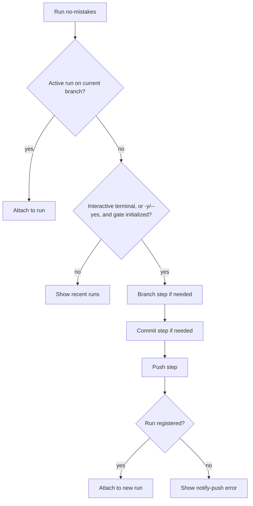

When you run `no-mistakes` with no arguments and there is no active run on the
current branch, `no-mistakes` can walk you through creating a branch,
committing local changes, and pushing through the gate, then attach if the
daemon registers the new run. This is the setup wizard.

The point of the wizard is to make bare `no-mistakes` a useful starting
command, not just an attach command. If you have local work but no run yet, the
wizard helps turn that state into branch -> commit -> push -> attach when the
daemon registers the new run.

The wizard kicks in when:

- You're in an interactive terminal, or you passed `no-mistakes -y` / `no-mistakes --yes`.
- The gate is initialized for the current repo (`no-mistakes init` has been run).
- There's no active run on the current branch.

In non-interactive contexts, bare `no-mistakes` without `-y` falls back to listing the last 5 runs instead.

With `-y` / `--yes`, the wizard takes the default automated path for each step: use routed suggestions for branch and commit when needed, then push to the gate.
In a TTY, that path stays visible and auto-advances through the wizard.
Without a TTY, it falls back to the headless path.

Pass `--skip` to skip comma-separated pipeline steps for the new run created by the wizard, for example `no-mistakes --skip test,lint`.
It only applies when the wizard starts a new pipeline run; if bare `no-mistakes` attaches to an active run or lists recent runs, `--skip` exits with an error.

If you want to attach to *any* active run in the repo (not just the current branch), use `no-mistakes attach` - that path skips the wizard entirely.

## Wizard flow

## Steps

The interactive wizard is a full-screen flow that runs only the steps your current repo state needs, up to three total. The `-y` / `--yes` path runs the same steps and accepts the automated default at each one. In a TTY, the TUI stays visible and auto-advances. Without a TTY, it runs headlessly.

While the wizard is running, it also updates your terminal window title with the current setup step and branch. On exit or cancel, it clears that temporary title.

### 1. Branch

Shown when you're on the default branch or a detached `HEAD`. Prompts for a branch name.

- Type a name to create a new branch.
- Leave blank and press enter to request a routed branch name suggestion based on your local changes.
- Press `q` to quit.

### 2. Commit

Shown when you have uncommitted changes. Prompts for a commit message.

- Type a message to commit all changes.
- Leave blank and press enter to request a routed commit subject suggestion based on the diff.

### 3. Push

Always shown. Asks whether to push the current branch to the `no-mistakes` gate.

- Press `y` to push.
- Press `n` to stop.

If the push succeeds, the interactive wizard stays visible in a brief `waiting for run…` state while the daemon registers the new run, then hands off to the main TUI and attaches. If no run appears in time, the wizard exits with an error instead of silently falling through, and points you at the gate's `notify-push.log` for hook diagnostics.

The goal is to keep the setup path short. If you already have a branch, it does
not ask for one. If everything is already committed, it skips straight to push.

## Retry on failure

If a git action fails (creating the branch, committing, or pushing), the interactive wizard shows the error and lets you press `r` to retry the step without restarting the whole flow.
A failed agent suggestion does not enter that failed state: the wizard returns you to the text input with an `agent unavailable: …` placeholder so you can enter the value yourself.

With `-y` / `--yes`, the wizard exits on the first error instead of prompting to retry, whether it is auto-advancing in a TTY or running headlessly.

## Quitting safely

Press `q` to quit.

If the wizard has already created a branch or commit on your behalf, quitting requires pressing `q` twice. The first press shows a confirmation warning so you don't accidentally leave those side effects behind. The second press exits.

That double-confirm is intentional. The wizard is allowed to make real Git side
effects, so exiting should not be too easy once those side effects exist.

## Routed suggestions

When you leave the branch name or commit subject blank, the wizard requests a suggestion through the `branch_commit_suggestion` purpose of the global routing contract.
That purpose routes to the `prose_fast` profile by default; see the [default profile and route tables](/no-mistakes/reference/routing/#default-routes).
The wizard is a standalone utility caller, not a fabricated pipeline run.
It records a durable `wizard` utility scope, gets a fresh provider-circuit set for its own session, and journals every routed suggestion attempt.
Inspect that history with `no-mistakes axi wizard`.

The routing contract the wizard uses is trusted: the global configuration plus any `routes` overrides read from the pinned default-branch copy of `.no-mistakes.yaml`.
Routes on the checked-out feature branch never influence wizard model selection.
If routing is unavailable or invalid, the wizard fails closed with an error instead of guessing a model.

The routed invocation sees the local diff and returns:

- a branch name: the prompt asks for kebab-case with a conventional type prefix (`feat/`, `fix/`, `chore/`, and so on), and the wizard sanitizes the reply into a valid lowercase git ref
- a commit subject: the prompt asks for conventional-commit format, using `feat` or `fix` for user-facing product impact so release automation can pick it up, and the wizard trims the reply to one line but keeps whatever valid type the model chose

Any managed agent-server output during the wizard is captured in `~/.no-mistakes/logs/wizard-agent.log`.

## Environment sanity

The wizard requires:

- The gate to be initialized (`no-mistakes init` has run).
- A clean enough state to commit and push.
- A valid routing contract.
  Every wizard session loads and validates routing before the interface starts, even when you type every value yourself, so an invalid contract blocks the wizard.
- A runner executable on `PATH` (`codex` or `claude` with the built-in defaults), only when you leave a value blank and a routed suggestion launches.
  If you enter the branch name and commit subject yourself, the wizard never launches a runner.

If any of those are missing, the wizard reports the problem and exits.
`no-mistakes doctor` is the fastest way to check the routing contract and runner availability.
