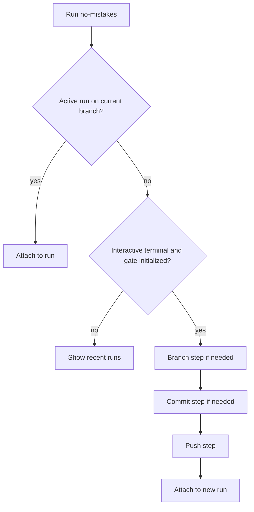

When you run `no-mistakes` with no arguments and there is no active run on the
current branch, `no-mistakes` can walk you through creating a branch,
committing local changes, and pushing through the gate before attaching to the
new run. This is the setup wizard.

The point of the wizard is to make bare `no-mistakes` a useful starting
command, not just an attach command. If you have local work but no run yet, the
wizard helps turn that state into branch -> commit -> push -> attach.

The wizard only kicks in when:

- You're in an interactive terminal.
- The gate is initialized for the current repo (`no-mistakes init` has been run).
- There's no active run on the current branch.

In non-interactive contexts, bare `no-mistakes` falls back to listing the last 5 runs instead.

If you want to attach to *any* active run in the repo (not just the current branch), use `no-mistakes attach` - that path skips the wizard entirely.

## Wizard flow

## Steps

The wizard is a full-screen flow that runs only the steps your current repo
state needs, up to three total:

### 1. Branch

Shown when you're on the default branch or a detached `HEAD`. Prompts for a branch name.

- Type a name to create a new branch.
- Leave blank and press enter to ask the configured agent for a branch name suggestion based on your local changes.
- Press `q` to quit.

### 2. Commit

Shown when you have uncommitted changes. Prompts for a commit message.

- Type a message to commit all changes.
- Leave blank and press enter to ask the configured agent for a commit subject suggestion based on the diff.

### 3. Push

Always shown. Asks whether to push the current branch to the `no-mistakes` gate.

- Press `y` to push.
- Press `n` to stop.

If the push succeeds, the wizard hands off to the main TUI and attaches to the new run.

The goal is to keep the setup path short. If you already have a branch, it does
not ask for one. If everything is already committed, it skips straight to push.

## Retry on failure

If any step fails (git error, agent error, network error), the wizard shows the error and lets you press `r` to retry the step without restarting the whole flow.

## Quitting safely

Press `q` to quit.

If the wizard has already created a branch or commit on your behalf, quitting requires pressing `q` twice. The first press shows a confirmation warning so you don't accidentally leave those side effects behind. The second press exits.

That double-confirm is intentional. The wizard is allowed to make real Git side
effects, so exiting should not be too easy once those side effects exist.

## Agent suggestions

When you leave branch name or commit subject blank, the wizard invokes the configured agent (global or per-repo `agent` setting) to produce a suggestion. The agent sees the local diff and returns:

- A kebab-case branch name prefixed with a type (`feat/`, `fix/`, `chore/`, etc.)
- A conventional-commit subject line

The managed agent server (Rovo Dev or OpenCode) writes its output to `~/.no-mistakes/logs/wizard-agent.log` during these runs.

## Environment sanity

The wizard requires:

- The gate to be initialized (`no-mistakes init` has run).
- A configured agent binary available on `PATH` (or via `agent_path_override`).
- A clean enough state to commit and push.

If any of those are missing, the wizard reports the problem and exits. `no-mistakes doctor` is the fastest way to see what's available.
