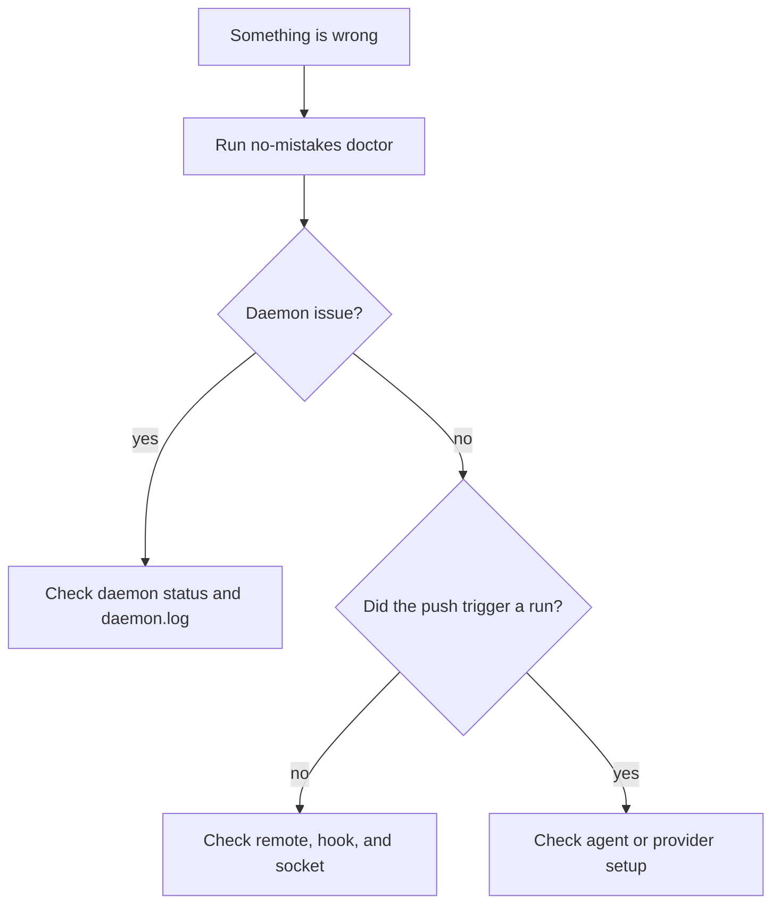

Most problems fall into one of three buckets: daemon not running, agent not
found, or push not triggering the pipeline. This page walks each one.

First stop for anything: `no-mistakes doctor`.

## Debug in this order



That order matches the actual boundaries in the system:

- local environment and binaries
- daemon and gate wiring
- provider-specific PR or CI integration

## Daemon won't start

Symptoms: `no-mistakes daemon status` shows stopped, or `no-mistakes` exits with "daemon not running."

### Start it manually

```sh
no-mistakes daemon start
```

This installs or refreshes the managed service (launchd, systemd user service, or Task Scheduler), then starts it. If service install or startup fails, it falls back to a detached daemon.

### Check logs

```sh
tail -f ~/.no-mistakes/logs/daemon.log
```

### Check for stale artifacts

A leftover socket from an unclean exit no longer blocks startup: the daemon probes the socket path before binding and removes it only when nothing is listening on it.
A stale PID file can still confuse status reporting:

```sh
ls -la ~/.no-mistakes/daemon.pid ~/.no-mistakes/socket
```

If the PID file points at a process that's no longer running, remove it and run `no-mistakes daemon start` again.

### "a no-mistakes daemon is already running for this NM_HOME"

This error always means a genuinely live daemon: the lock it reports cannot go stale (see [Daemon & Worktrees](/no-mistakes/concepts/daemon/) for the singleton-lock model).
Manage that daemon with `no-mistakes daemon status` and `no-mistakes daemon stop` instead of deleting the lock file - deleting the file does not release the lock and only weakens the guard.

If the socket exists and the process is running but stuck or unresponsive, `no-mistakes` bounds the connection wait with [`daemon_connect_timeout`](/no-mistakes/reference/global-config/#daemon_connect_timeout) and fails fast with an error naming the socket path instead of silently starting a second daemon. Restart the stuck daemon:

```sh
no-mistakes daemon stop
no-mistakes daemon start
```

If the socket file exists but nothing answers at all (a dead socket left behind by an unclean exit, e.g. a crash or `SIGKILL`), commands that ensure the daemon is running (`no-mistakes`, `init`, `attach`, `rerun`, `axi run`, `axi respond`) now fail fast with a `connect to daemon socket` error instead of silently starting a replacement daemon. The error message itself includes a `(run 'no-mistakes daemon start' to recover)` hint - run `no-mistakes daemon start` directly to recover, since it self-heals past a dead socket and starts a fresh daemon.

### Managed service logs

- **macOS (launchd):** `launchctl list | grep no-mistakes` and check `~/Library/LaunchAgents/com.kunchenguid.no-mistakes.daemon.*.plist`
- **Linux (systemd):** `systemctl --user status no-mistakes-daemon-*` and `journalctl --user -u no-mistakes-daemon-* -f`
- **Windows (Task Scheduler):** `schtasks /query /tn "no-mistakes-daemon-*"`

### `NM_HOME` collisions

If you have multiple installs with different `NM_HOME` roots, each gets its own scoped service name (with a short suffix derived from the path). Make sure you're looking at the right one - `no-mistakes daemon status` reports which.

## `no-mistakes update` refuses or aborts

Symptom: `update` refuses because active pipeline runs are in progress, prompts because the daemon is running from a different executable path, or aborts because the daemon executable path cannot be determined.

`update`, `daemon stop`, and `daemon restart` all refuse by default while pipeline runs are active and list the affected runs; [Daemon & Worktrees](/no-mistakes/concepts/daemon/#starting-and-stopping) owns the guard's exact rules, including why `-y`/`--yes` does not bypass it.

First inspect each listed run with `no-mistakes axi status --run <id>`.
A parked CI gate can clear itself after its PR becomes terminal, including after a daemon restart.
The [`ci_timeout` reference](/no-mistakes/reference/global-config/#ci_timeout) owns the exact fail-closed reconciliation rules, and [Daemon & Worktrees](/no-mistakes/concepts/daemon/#crash-recovery) owns restart behavior.

When upgrading from an older release that left a merged/closed PR at a stale CI gate, verify the PR state independently, check out the matching branch, and run `no-mistakes axi respond --action approve --step ci` before retrying the update.
Do not edit `state.sqlite` directly.

Only when you have confirmed it is acceptable for every remaining listed active run to fail, force the lifecycle operation:

```sh
no-mistakes daemon stop --force
no-mistakes update
```

## Agent binary not detected

Symptom: `doctor` reports that gate validation is unavailable, or a run fails before its first pipeline step because no runnable agent was found.

This is a hard failure, not a degraded validation mode.
`no-mistakes` will not silently skip review, test evidence, documentation, or agent-assisted lint and report the remaining work as a passed gate.

### Check PATH

The daemon uses the same binary-discovery order described in [Choosing an Agent](/no-mistakes/guides/agents/). When it's running through a managed service, it reloads `PATH` from your login shell on macOS and Linux and appends common install locations such as `~/.local/bin`, `~/go/bin`, `~/.cargo/bin`, `~/bin`, `/opt/homebrew/bin`, `/usr/local/bin`, `/usr/bin`, and `/bin`.

If a native agent is installed in a version-manager shim directory or another nonstandard location, set an explicit override in `~/.no-mistakes/config.yaml`:

```yaml
agent_path_override:
  claude: /Users/you/.local/bin/claude
```

For `agent: acp:<target>` and ACP aliases such as `agent: cursor`, set `acpx_path` for the bridge.
If the raw target command is also outside `PATH`, set its target key in `acp_registry_overrides`; `agent_path_override` applies only to native agents:

```yaml
acpx_path: /Users/you/.local/bin/acpx
acp_registry_overrides:
  cursor: /Users/you/.local/bin/cursor-agent acp
```

For Antigravity or Gemini-based driving agents, install a supported native agent CLI separately or configure a working ACP target such as `agent: acp:gemini` with `acpx` installed.
The calling agent is the AXI driver, not an implicit pipeline-agent backend.

The daemon logs its effective `PATH` at startup in `~/.no-mistakes/logs/daemon.log` with the message `daemon environment ready`. If the log contains `login shell environment resolution failed` or `login shell environment resolution returned no entries`, the daemon used a degraded fallback `PATH` that may omit version-manager directories such as nvm, fnm, or volta, so tools like `pnpm` may be missing.

### Restart the daemon after installing a new agent

```sh
no-mistakes daemon stop
no-mistakes daemon start
```

## Agents fail with "403 Request not allowed" behind a proxy

Symptom: runs fail and the step log shows agents (for example `claude --print`) unable to reach the network, often with `403 Request not allowed`.

A managed daemon started by launchd or systemd inherits only a minimal environment, so it does not see the `HTTP_PROXY` / `HTTPS_PROXY` / `NO_PROXY` / `ALL_PROXY` variables from your shell. `no-mistakes` bakes any proxy variables that are set when you install or refresh the service into the generated service definition. If you set up the proxy after installing, re-run the installer or `no-mistakes daemon restart` (with the proxy variables exported) so they get baked in, then confirm them in `~/.config/systemd/user/no-mistakes-daemon-*.service` on Linux or `~/Library/LaunchAgents/com.kunchenguid.no-mistakes.daemon.*.plist` on macOS. Once baked in, the values survive later restarts and binary upgrades even from a shell that does not export them, so you only need the variables exported the first time. Windows Task Scheduler inherits your logon environment and needs no forwarding.

## macOS App Management prompts during agent runs

Pipeline prompts steer agents to keep intentional writes inside the disposable worktree and avoid mutating system locations such as `/Applications`, Homebrew-managed packages, or global tool configuration.
This reduces macOS App Management prompts from agent-invoked commands, but it is not an OS sandbox.

If you still see prompts, check the step log for commands that intentionally write outside the worktree and move that setup into your normal development environment or an explicit repo-local command.
Requested test evidence may still be written under the managed temporary `no-mistakes-evidence` directory, or under the configured in-repo evidence directory when `test.evidence.store_in_repo` is enabled.
Normal tool temp or cache writes can still happen outside the worktree.
Testing prompts ask agents to remove transient working-tree artifacts they created, such as downloaded models, caches, build outputs, large binaries, or generated data directories, before completion.

## A pipeline step failed

Symptom: a run stops with a failed step.

Check the per-step log at `~/.no-mistakes/logs/<runID>/<step>.log`.
Fatal step errors are appended to that log, so failures such as rejected pushes include the returned error output there instead of only appearing in `daemon.log`.

### Push fails with `refusing to force-push`

This means the live remote branch changed after the pipeline's last observed head and contains commit(s) the validated worktree did not incorporate.
`no-mistakes` refuses the push instead of overwriting that remote work.

Fetch and inspect the configured push target, then rebase or merge the remote work into your branch before pushing through `no-mistakes` again.
If the overwrite is intentional, push manually to the actual remote after reviewing the commits that would be discarded.

### Rebase pauses because the branch carries unpushed default-branch commits

This means the branch was created from a local default branch that is ahead of `origin/<default_branch>`, so its history includes commits that exist only on your local default branch.
`no-mistakes` pauses with an `ask-user` finding instead of silently bundling that unrelated local work into the PR.

Push the default branch to `origin` if those commits belong in the shared base, or rebase your feature branch onto `origin/<default_branch>` to remove the unrelated work before running the gate again.
Approve the finding only when you intentionally want that local default-branch work to stay in the branch.

## `git push no-mistakes` doesn't start a pipeline

Symptom: push succeeds but `no-mistakes` shows no active run.

### Check the remote

```sh
git remote -v | grep no-mistakes
```

If it's missing, run `no-mistakes init` again.
Re-running init refreshes an existing gate and repairs the `no-mistakes` remote when it is missing.
It also reattaches an existing gate after you rename or move the repo directory, as long as the old path no longer exists.

### Check the hook

The gate's bare repo has a `post-receive` hook that notifies the daemon. Look at the gate path:

```sh
no-mistakes status
# gate path is shown in the output

ls -la <gate-path>/hooks/post-receive
```

The hook should be executable. If it's missing or non-executable, `no-mistakes init` will reinstall it for an existing no-mistakes-managed gate.
For existing gate repos, `no-mistakes daemon restart` also installs missing no-mistakes-managed hooks and refreshes legacy managed hooks without overwriting custom hooks.
Current managed hooks resolve the gate as an absolute bare-repo path before notifying the daemon, so a shell with a bad `PWD` value cannot accidentally report the gate as `.`.
If `notify-push.log` mentions `invalid gate path: .`, refresh the managed hook with `no-mistakes init` or `no-mistakes daemon restart`, then push again.

Also check `<gate-path>/notify-push.log`. The hook now appends daemon notification failures there and prints the same error back to the pushing client.

### Check the daemon socket

The hook talks to the daemon over `~/.no-mistakes/socket`. If the daemon isn't running, the push still succeeds (the hook never blocks), but no pipeline starts. Start the daemon and push again.

If the gate is older, re-running `no-mistakes init` or restarting the daemon also reapplies hook-path isolation for existing bare repos when Git supports `config --worktree`.
That protects the gate hook if a tool such as Husky wrote `core.hookspath` into shared git config from inside a linked worktree.

## PR step is skipped

Symptom: pipeline completes but the PR step shows `skipped`.

Check the [Provider Integration](/no-mistakes/guides/provider-integration/) requirements. Most common causes:

- `gh` or `glab` not installed
- `gh auth status` shows not authenticated
- Bitbucket env vars not set in the daemon's environment
- Upstream is on a host that isn't supported (GitHub, GitLab, `bitbucket.org`, or Azure DevOps)
- Self-hosted GitHub Enterprise on a hostname that is not `github.com` isn't detected because `gh` isn't configured for the host; run `gh auth login --hostname your-ghe.example.com` so detection finds it. Once detection succeeds, the availability check is host-scoped (`gh auth status --hostname your-ghe.example.com`), so a stale token on `github.com` or any other configured gh host can no longer falsely mark the GHE repo as unauthenticated.
- Self-hosted GitLab on a hostname with no `gitlab` marker isn't detected because `glab` isn't configured for the host; run `glab auth login --hostname your-gitlab.example.com` so detection finds it. Once detection succeeds, the availability check is host-scoped (`glab auth status --hostname your-gitlab.example.com`), so a stale token on `gitlab.com` or any other configured glab host can no longer falsely mark the self-hosted repo as unauthenticated.
- A GitLab, Bitbucket, or Azure DevOps repo record has a fork URL set; fork MR/PR routing is currently GitHub-only
- You pushed the default branch (PR step always skips on the default branch)

## CI step stuck or timed out

Symptom: CI step keeps monitoring an open PR longer than expected, or pauses after the idle timeout.

Monitoring while the PR remains open - even after checks are currently healthy - is intended behavior, because a later default-branch update can make the PR conflict or rerun CI.
Once checks are green and the PR is mergeable, the CI panel shows `✓ Checks passed` and the terminal title switches to `Checks passed`, so you can tell when to go merge the PR; the signal clears automatically if checks start re-running or a new failure appears.

How long the monitor runs is controlled by `ci_timeout` in `~/.no-mistakes/config.yaml`, an idle timeout that re-arms whenever the upstream default branch advances; the [`ci_timeout` field reference](/no-mistakes/reference/global-config/#ci_timeout) owns the default, the `unlimited` keyword and its aliases, and the exact re-arm semantics.
Older config files may still contain an explicit `ci_timeout: "4h"` value; update it if you want the newer default behavior.

If the PR is still open at the timeout, the step pauses for approval with findings for the open monitoring state or any known unresolved failures.
You can approve, fix, or skip from the TUI or `no-mistakes axi respond`.
Use `no-mistakes axi abort` only when you mean to cancel the whole active run.

## Step looks quiet or wedged

Symptom: `no-mistakes axi status` shows an active step with `last_activity` prefixed by `quiet`, or a review/test/lint step appears to run for longer than expected.

`quiet` means the step has not recorded a step-log line or native-agent lifecycle event for longer than [`step_quiet_warning`](/no-mistakes/reference/global-config/#step_quiet_warning).
It is only a liveness signal.
It does not cancel the step, fail the run, or mean the pipeline is safe to bypass.

Start by reading the active run and the step log:

```sh
no-mistakes axi status
no-mistakes axi logs --step <step> --full
```

The `active_steps` table shows how long the step has been active, the latest activity, the native subprocess PID when one is running, and the current round such as `round 1`, `auto-fix 1/3`, or `fix 2`.
The step log records native subprocess start, exit, and retry lines plus markers for automatic and user-triggered fix rounds.
If the step is parked at a gate, use `no-mistakes axi respond` instead of waiting.
If the run is genuinely stuck and you want to discard it, use `no-mistakes axi abort` and then start a new run.

## Worktree won't clean up

Symptom: `~/.no-mistakes/worktrees/<repoID>/<runID>/` sticks around after a run ends.

The daemon removes worktrees at run completion, and also on daemon startup (crash recovery). If one is still there:

```sh
# From inside the repo the worktree belongs to:
git worktree list
git worktree remove --force <path>
```

Or let the daemon clean it on next startup:

```sh
no-mistakes daemon stop
no-mistakes daemon start
```

## Reset everything

When state is genuinely wedged:

```sh
no-mistakes daemon stop --force
rm -rf ~/.no-mistakes/worktrees ~/.no-mistakes/servers ~/.no-mistakes/socket ~/.no-mistakes/daemon.pid ~/.no-mistakes/daemon.lock
no-mistakes daemon start
```

This keeps your gate repos, database, and config but clears transient state. For a full wipe, see the [Uninstall section](/no-mistakes/start-here/installation/#uninstall).
Wedged state often means a run is stuck `pending` or `running`, so `daemon stop` refuses without `--force`; only force through once you've confirmed it's fine for the listed runs to fail.

## Still stuck

- Check `~/.no-mistakes/logs/daemon.log` at `log_level: debug`
- File an issue: <https://github.com/kunchenguid/no-mistakes/issues>
- Discord: <https://discord.gg/Wsy2NpnZDu>
