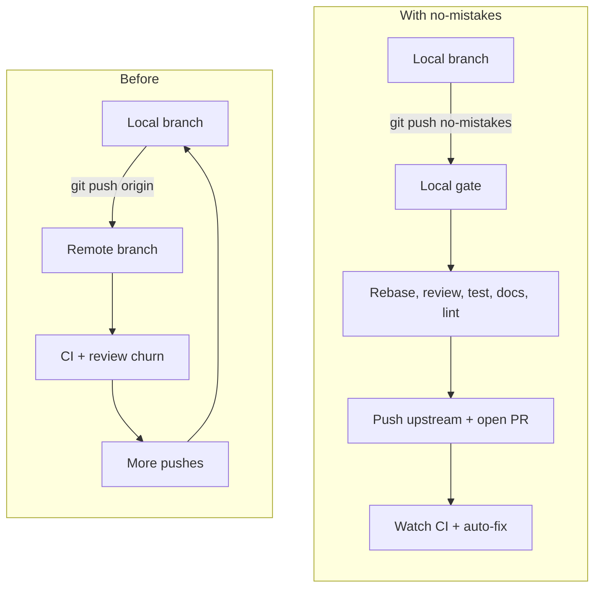

## The Bottleneck Moved

AI made writing code cheaper. The slower part now is validation: reviewing the
diff, catching obvious breakage, updating docs, waiting for CI, and turning
"the agent says it is done" into "I am comfortable sharing this branch."

Most of that quality infrastructure still lives in the outer loop, after the
branch is already public. `no-mistakes` moves more of that loop closer to where
you are working.

## Why The Gate Is Explicit

`no-mistakes` does not hijack `origin`. It adds a separate `no-mistakes`
remote and asks you to push to it on purpose.

- `git push origin` still works when you want the escape hatch.
- `git push no-mistakes` means "run the full gate before this branch leaves my machine."
- A passed gate means the same thing everywhere because the pipeline order stays fixed.

## What Comes Out The Other Side

A gated push is trying to turn a rough branch into a cleaner handoff:

| Before the gate | After the gate |
|---|---|
| Raw branch diff | Rebases onto fresh upstream |
| Review debt | AI review findings surfaced early |
| Unknown test health | Tests run before push |
| Missing docs | Documentation gaps called out |
| Formatting and lint churn | Linters run after code settles |
| Blind PR wait | PR opened and CI watched automatically |

## Start Here

- [Quick Start](/no-mistakes/start-here/quick-start/) - first gated push in a few minutes
- [Introduction](/no-mistakes/start-here/introduction/) - why the tool exists and how to think about it
- [The Gate Model](/no-mistakes/concepts/gate-model/) - architecture, push flow, and design choices
