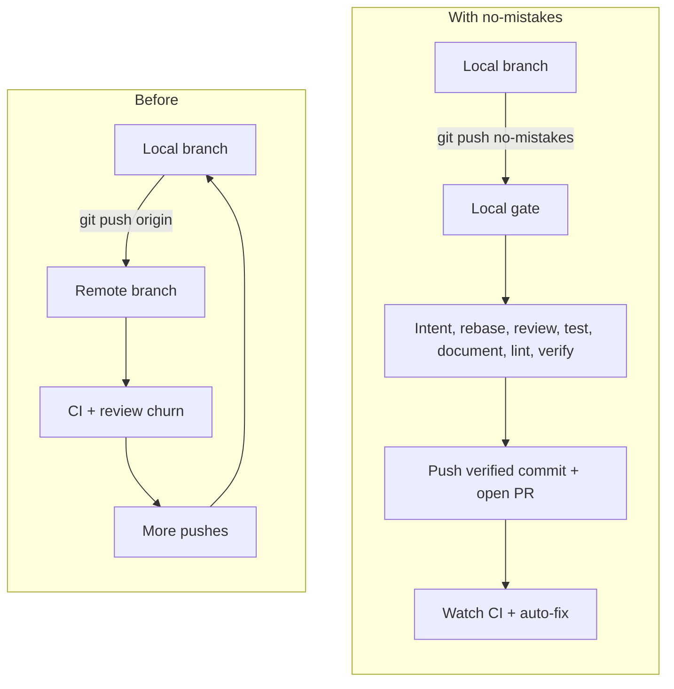

## The bottleneck has moved

AI agents generate mountains of code.
Some of it is brilliant.
Some of it is slop.
You cannot tell which is which at 5,000 lines per diff.
The bottleneck is not writing code anymore.
It is reviewing and validating it.

Most of that quality infrastructure still lives in the outer loop, after the branch is already public.
`no-mistakes` moves more of that loop closer to where you are working.

## What happens to a gated push

A gated push turns a rough branch into a clean PR:

| Before the gate | After the gate |
|---|---|
| Raw branch diff | Rebased onto fresh upstream and the pushed branch |
| Bugs and tech debt | AI review catches problems early |
| Uneven test coverage | Regression and new tests executed |
| Missing docs | Documentation kept up to date |
| Formatting and lint churn | Linter and formatter done before push |
| One model for everything | Every model call routed by purpose, with provider failover |
| Manually raise and shepherd the PR | PR opened and CI watched automatically |

## Start here

- [Quick start](/no-mistakes/start-here/quick-start/) - first gated push in a few minutes
- [Introduction](/no-mistakes/start-here/introduction/) - why the tool exists and how to think about it
- [Routing reference](/no-mistakes/reference/routing/) - how every model call is selected
- [The gate model](/no-mistakes/concepts/gate-model/) - architecture, push flow, and design choices
