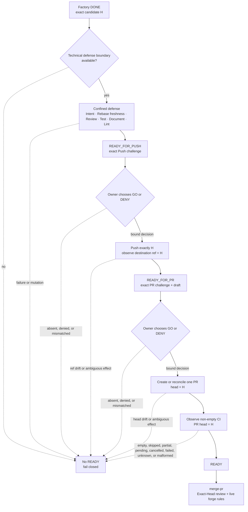

The `factory-publication-v1` profile begins only after Agent Factory has
finished a Protected build-loop run. Agent Factory remains responsible for
Build, Check, Review, DoD, P4, resume, and the final candidate commit `H`.
No Mistakes then adds a publication gate around that exact candidate; it does
not start another build loop and may not rewrite `H`.

> **Implementation status: Linux-gated preview.** The protocol, persistence,
> exact-effect gates, crash recovery, and offline core journey are implemented.
> The production path now discovers and pins one exact Codex runtime, then runs
> a model-free filesystem, credential, network, and PID-namespace capability
> probe before admission. Unsupported platforms, missing primitives, profile
> drift, and ordinary probe failures remain `confinement_unavailable`; an
> uncertain post-start cleanup is a stronger startup failure and retains its
> evidence instead of pretending that teardown completed.
> This slice is not release-ready until its exact tagged binary passes the
> non-skipped Linux gate; the offline unconfined journey is not that evidence.

> This diagram explains observed product states. It is not an approval or
> trust surface. Only a canonical request and a durable Owner decision bound
> to the exact next effect can authorize Push or PR. A PR marker is a recovery
> locator, not proof. `merge-pr` and the forge's live rules remain the final
> merge-time trust boundary.

## Happy path



The same path in words:

1. Agent Factory reaches terminal `DONE` and binds the candidate repository,
   branch, exact base commit `BaseSHA`, tree, WorkContract, and exact commit
   `H` into a canonical request.
2. Once the required technical defense boundary exists, No Mistakes derives
   the `publication_id` from the canonical request bytes and admits the
   candidate into its existing Run and executor. A host without the exact
   supported Codex boundary stops before this point with
   `confinement_unavailable`.
3. Intent and Rebase validate the binding and freshness without changing the
   candidate.
4. Review, Test, Document, and Lint run inside the inherited confinement
   boundary as defense in depth.
5. `READY_FOR_PUSH` parks before any remote mutation and returns the complete,
   inspectable Push challenge. The challenge carries distinct digests for the
   exact `GO` and `DENY` decisions.
6. An Owner decision built from that challenge and bound to this publication,
   `H`, remote, destination ref, and exact Push effect permits one Push
   invocation. Once authorized or started, the public state is `CHECKING`, not
   another usable decision gate. No Mistakes then observes the destination ref
   at `H`.
7. `READY_FOR_PR` parks again and returns the complete PR challenge. It includes
   the exact rendered draft bytes and raw-byte digest for inspection, plus
   distinct `GO` and `DENY` decision digests. A separate Owner decision binds
   the base, head, and that draft before one PR invocation.
8. No Mistakes creates or reconciles exactly one PR whose head is `H`.
9. It observes a non-empty set of fully passing CI checks while both the PR
   head and every check remain bound to `H`.
10. `READY` hands the candidate to `merge-pr`. No Mistakes does not merge it;
    Exact-Head review and the forge's live rules are checked at merge time.

## What the request binds

The canonical request binds the Factory run and terminal T10 evidence, the
run-state prefix and PlanBinding hashes, the WorkContract path and raw-byte
hash, a bounded build-intent projection, repository and branch identities,
base ref and exact `BaseSHA`, commit `H`, candidate tree, publisher binary identity, and the closed
Push, PR, and read-only CI scopes. Its lowercase SHA-256 is the
`publication_id`. Reusing that ID with different bytes or attaching to an
ordinary AXI Run is refused.

The WorkContract is read from commit `H` and checked byte for byte. No Mistakes
does not parse or reinterpret the Factory contract, make a new P4 decision, or
write back into Factory state.

## Fail-closed outcomes

`READY` is the only successful terminal result. Every other result is
non-success, including an intermediate state that is still waiting for an
exact decision or CI observation.

| Observation | Result behavior | External effect |
| --- | --- | --- |
| Technical defense confinement is unavailable | Production admission is refused with `confinement_unavailable` | None |
| Defense is still running | `CHECKING` | None |
| Exact Push decision is not yet present | `READY_FOR_PUSH` with one exact Push challenge | Push is not invoked |
| Push is authorized or may be starting | `CHECKING`, with no reusable challenge | At most one exact invocation |
| Exact PR decision is not yet present | `READY_FOR_PR` with one exact PR challenge and inspectable draft | PR is not invoked |
| PR is authorized or may be starting | `CHECKING`, with no reusable challenge | At most one exact invocation |
| CI at `H` is not yet complete | `CI_OBSERVING` | Read-only observation only |
| Candidate, tree, ref, PR head, draft, or binding drifts | Never `READY`; reports a closed non-success such as `DRIFT` | The mismatched decision cannot authorize an effect |
| An Owner decision is denied or does not match its exact effect | `DENIED` or the corresponding waiting state | None |
| A defense step fails, skips, is partial, or requests a mutation | `FAILED` or `DRIFT` | None |
| A Push or PR may have begun but cannot be reconciled exactly once | `EFFECT_UNKNOWN` | Never replayed blindly |
| CI is empty, skipped, partial, cancelled, failed, unknown, malformed, or bound to another head | Never `READY` | No fix, rerun, commit, or Push |
| CI is pending | `CI_OBSERVING`, not success | Read-only observation only |

An authorized effect is single-use. After it may have begun, recovery first
reconciles the exact remote or PR observation. Zero or multiple matching PRs
after a possible PR invocation become `EFFECT_UNKNOWN`; the profile never
adopts an unrelated PR or creates a replacement blindly.

## Machine interface

```sh
no-mistakes publication start
no-mistakes publication authorize
no-mistakes publication status
```

The commands read strict canonical `factory-publication-v1` JSON from standard
input or a named request file and write one closed JSON result to standard
output. Progress belongs on standard error. Unknown, missing, duplicate,
malformed, non-canonical, or trailing input is rejected. A successful process
exit means the result status is exactly `READY`; no other status is success.

On an unsupported or unproven host, `start` and `authorize` fail closed before
admission because the required defense confinement is unavailable. The
test-only unconfined boundary used by the offline core journey is not a
supported production mode and is not confinement evidence. Release credit for
the Linux boundary requires the repository's non-skipped tagged lifecycle
canary on the exact shipped bytes; a cross-compile or missing-runtime refusal
does not earn that credit.

`READY_FOR_PUSH` and `READY_FOR_PR` results contain everything needed to build
the corresponding canonical `authorize` envelope. The caller chooses either
`GO` or `DENY` and uses the matching decision digest; it must not reconstruct
or infer hidden state. A challenge disappears as soon as its decision is
durable and cannot be transferred to another publication, effect, attempt,
head, remote, ref, or draft.

The profile is GitHub-only in v1. The repository must already be registered;
this flow never calls `no-mistakes init`. Fork routing is deliberately refused
in v1 until the protocol can bind the head repository separately. Ordinary AXI
runs keep their existing behavior and cannot attach to a Factory publication.
